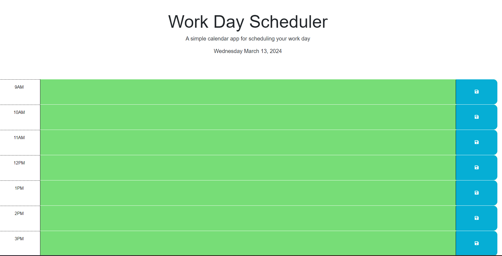

Description: This is a work day scheduler which has a time from 9AM - 5Pm.
The user can put some text or event on the textarea. The color of the textarea will change the color, gray for the past time, red for the current or present time, and green for future.

The URL of my deployed application: https://romy52112.github.io/Planner/

The URL of the GitHub repository: https://github.com/Romy52112/Planner

Screenshot : 
